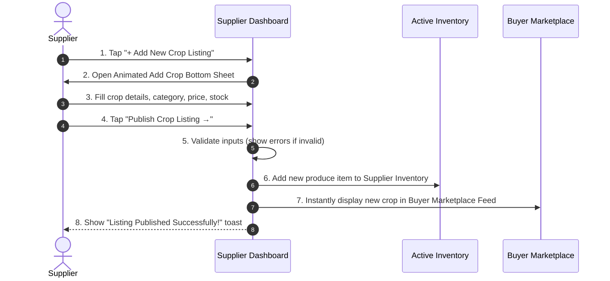

# Agri Hub — Add Crop Listing Specification

## 1. Overview
The **Add Crop Listing** feature enables registered **Suppliers** to list their agricultural harvest, seeds, fertilizers, or tools onto the **Agri Hub Marketplace**.

---

## 2. Form Specifications & Field Validation

| Field Name | Input Type | Requirement | Validation Rules | Example |
| :--- | :--- | :--- | :--- | :--- |
| **Produce / Crop Name** | Text Input | Required | Min 2 characters | *Sharbati Premium Wheat* |
| **Category** | Chip Selector | Required | Must select 1 category | *Grains & Pulses 🌾* |
| **Price per Unit (₹)** | Numeric Input | Required | Positive integer | `2450` |
| **Unit Type** | Dropdown / Chips | Required | Must select unit | *Quintal*, *Kg*, *Bag*, *Day* |
| **Total Stock Available** | Numeric Input | Required | Positive integer | `250` |
| **Minimum Order Qty (MOQ)** | Text Input | Required | Text description | *10 Quintals* |

---

## 3. Form Lifecycle & State Flow

---

## 4. Immediate Inventory & Marketplace Sync
When a supplier clicks **Publish Crop Listing**:
1. The new item is added to the **Supplier's Active Inventory list** (`SupplierDashboardScreen`).
2. The `activeListings` stat counter increments (`12` → `13`).
3. The crop becomes searchable in the **Buyer Marketplace Feed** under its selected category!
