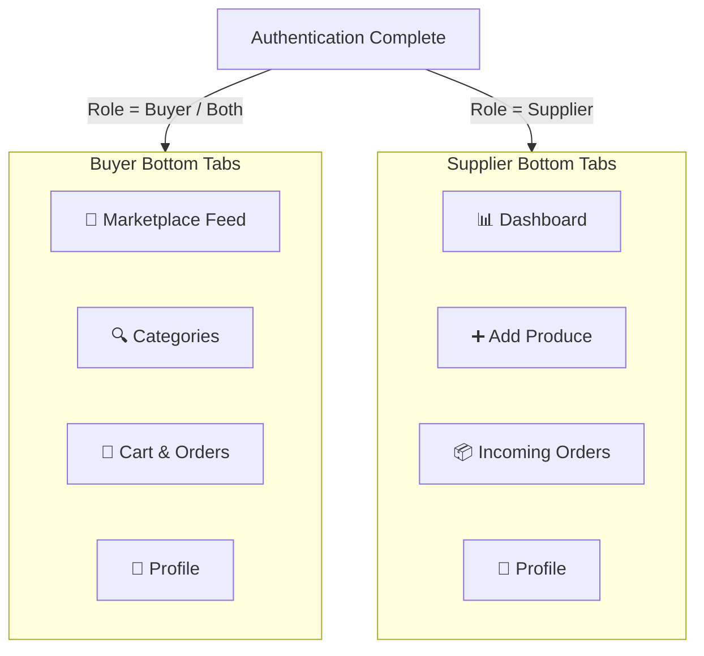

# Agri Hub — Marketplace & Dashboard Specifications

## 1. Overview
After completing Registration or Sign In, users enter the main application. **Agri Hub** renders a role-customized experience based on whether the user is a **Buyer**, **Supplier**, or **Both**.

---

## 2. Navigation Architecture (Bottom Tab Navigator)

---

## 3. Core Screen Breakdown

### A. 🌾 Buyer Marketplace Feed (`MarketplaceScreen`)
* **Header Bar:** Location Selector ("Punjab, India"), Search Input, Cart Badge.
* **Category Filters:** All, Grains & Pulses 🌾, Vegetables 🥬, Fruits 🍎, Seeds & Fertilizers 🧪, Equipment 🚜.
* **Produce Listing Cards:**
  * Produce Name (e.g. *Organic Sharbati Wheat*).
  * Quality Grade & Organic Badge.
  * Price per Unit (e.g. `₹2,400 / Quintal`).
  * Supplier Name & Verification Badge.
  * Location distance & Minimum Order Quantity (MOQ).
  * Action: **"Inquire / Add to Cart"**.

### B. 📊 Supplier Dashboard (`SupplierDashboardScreen`)
* **Quick Stats Cards:** Total Active Listings, Total Sales Revenue, Pending Orders.
* **Quick Action:** `+ Add New Crop Listing` (Title, Category, Price, Quantity, Photos).
* **My Listings Grid:** Manage stock quantity, pause listing, update price.
* **Incoming Orders List:** Accept / Reject orders, update delivery status.

---

## 4. Next Implementation Steps

1. Install React Navigation (`@react-navigation/native`, `@react-navigation/bottom-tabs`).
2. Build `MarketplaceScreen.tsx` with sample agricultural produce data.
3. Build `SupplierDashboardScreen.tsx` with inventory and order tracking widgets.
4. Wire navigation from the Auth Success card into the main app!
