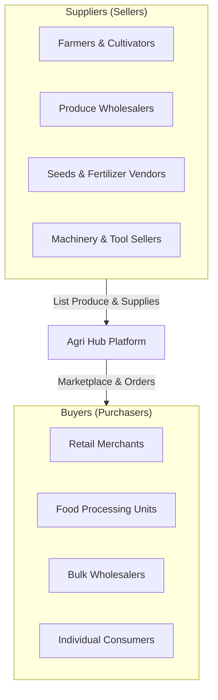

# Agri Hub — Product Requirements & Architecture Documentation

## 1. Executive Summary
**Agri Hub** is a two-sided B2B/B2C agricultural marketplace mobile application built with React Native and Expo. The platform connects **Suppliers** (Farmers, Grain Merchants, Agricultural Input & Equipment Vendors) directly with **Buyers** (Wholesalers, Distributors, Retailers, and Commercial Consumers).

---

## 2. Core Stakeholders & User Roles



---

## 3. Role Breakdown & Feature Matrix

### 🚜 Supplier Persona (Sellers)
* **Goal:** Expand market reach, sell agricultural produce/inputs at competitive prices, and manage order fulfillment.
* **Key Features:**
  * **Product Inventory Management:** Add, edit, and categorize crops, seeds, fertilizers, or tools with photos, pricing, and stock levels.
  * **Order Fulfillment Dashboard:** Receive buyer orders, update shipping/delivery status, and view sales history.
  * **Price & Stock Controls:** Update prices dynamically based on market demand and harvest yields.
  * **Sales Analytics:** Track revenue, top-selling produce, and pending payouts.

### 🛒 Buyer Persona (Purchasers)
* **Goal:** Source quality agricultural produce and farming supplies directly from verified suppliers with transparent pricing.
* **Key Features:**
  * **Marketplace Catalog:** Search and filter by crop type, quality grade, organic certification, location, and price.
  * **Order Placement & Cart:** Bulk order placement, price negotiation, and secure checkout options.
  * **Live Order Tracking:** Monitor order progress from farm pick-up to doorstep delivery.
  * **Supplier Ratings & Reviews:** View ratings and feedback for suppliers before placing bulk orders.

---

## 4. Platform Feature Roadmap

| Module | Features | Target User | Status |
| :--- | :--- | :--- | :--- |
| **Auth & Onboarding** | Mobile/OTP Login, Role Selection (Supplier / Buyer Profile) | All Users | 📋 Planned |
| **Marketplace Feed** | Categorized listings, search, location-based filtering | Buyers | 📋 Planned |
| **Supplier Dashboard** | Product upload, inventory management, price configuration | Suppliers | 📋 Planned |
| **Cart & Checkout** | Quantity selection, address management, payment integration | Buyers | 📋 Planned |
| **Order Management** | Status updates (Pending, Dispatched, Delivered, Cancelled) | Both | 📋 Planned |
| **Direct Communication** | In-app messaging / Inquiry system for bulk negotiation | Both | 📋 Planned |

---

## 5. Technical Stack Architecture

* **Mobile Framework:** React Native (Expo SDK ~51)
* **Language:** TypeScript (`strict: true`)
* **Design System:** Custom Design Tokens (`colors.ts`, `spacing.ts`, `typography.ts`)
* **Theming:** Dynamic Light / Dark Mode (`ThemeContext.tsx`)
* **Icons:** `lucide-react-native`
* **Layout Utilities:** `react-native-safe-area-context`, `react-native-screens`

---

## 6. Directory Structure Overview
```text
agro_react_native/
├── _documentation/         # Product requirements, architecture & specs
├── assets/                 # App icons, splash screens, media
├── src/
│   ├── components/         # Reusable UI primitives (AppText, Button, Card, ScreenWrapper)
│   ├── screens/            # App screen views (HomeScreen, Marketplace, SupplierDashboard)
│   ├── theme/              # Centralized Design Tokens & ThemeContext
│   ├── navigation/         # (Planned) React Navigation Stack & Tab definitions
│   └── services/           # (Planned) API services & data fetching
├── App.tsx                 # Application root entry point
├── app.json                # Expo configuration (Agri Hub)
└── package.json            # Project dependencies & scripts
```
