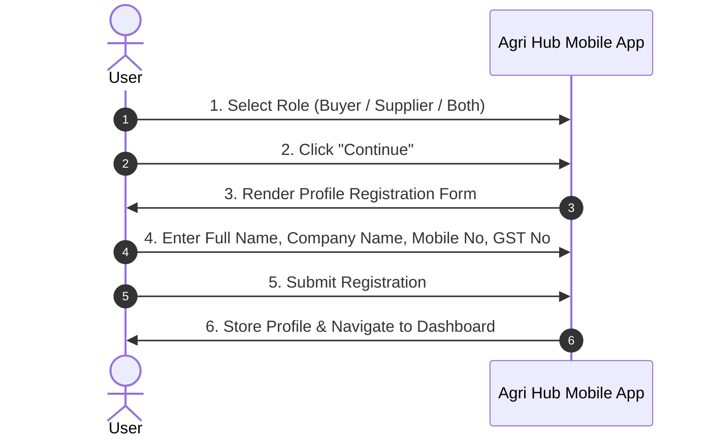

# Agri Hub — User Registration & Onboarding Specification

## 1. Overview
After a user selects their role (**Buyer**, **Supplier**, or **Both**), they are presented with the Profile Setup & Verification form to collect business and contact details.

---

## 2. Onboarding Flow Sequence

---

## 3. Form Field Specifications

| Field Name | Type | Requirement | Keyboard Type | Validation Rule |
| :--- | :--- | :--- | :--- | :--- |
| **Full Name** | `string` | **Required** | Default | Minimum 2 characters |
| **Company / Business Name** | `string` | Optional | Default | Optional string |
| **Mobile Number** | `string` | **Required** | Phone / Numeric | 10-digit valid mobile number |
| **GST Number** | `string` | Optional | Alphanumeric (Uppercase) | 15-character GSTIN format |

---

## 4. Role-Based Field Adaptations

* **Buyer Role:** Full Name & Mobile Number required. Company Name & GST optional.
* **Supplier Role:** Full Name, Company Name, & Mobile required. GST recommended for tax invoice generation.
* **Both Role:** Full profile required.

---

## 5. Next Steps
1. Create reusable styled `AppInput` component for clean design system integration.
2. Build multi-step flow or screen transition from Role Selection -> Profile Form.
3. Validate inputs and store registration state.
