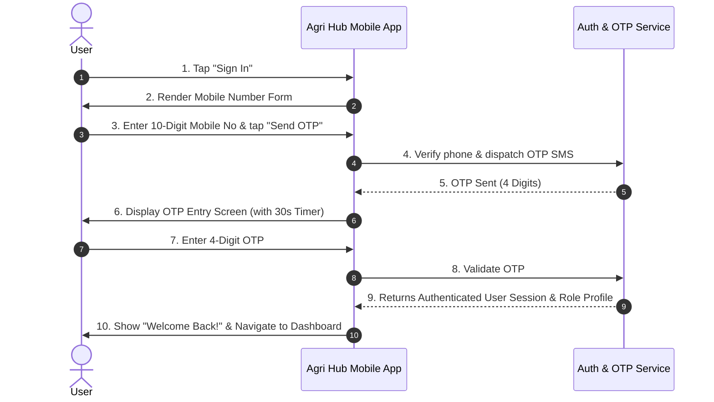

# Agri Hub — Sign In & Mobile OTP Authentication Specification

## 1. Executive Summary
The **Sign In** workflow enables existing registered users (**Buyers**, **Suppliers**, or **Both**) to quickly authenticate using their **10-Digit Mobile Number** and **4-Digit OTP (One-Time Password)**.

---

## 2. Authentication Sequence

---

## 3. Screen States Breakdown

### State A: Mobile Number Entry (`signin_phone`)
* **Inputs:** Registered 10-digit mobile number.
* **Validation:** Must be 10 numeric digits.
* **Action:** "Send OTP →".
* **Prompt:** "Don't have an account? **Register**".

### State B: OTP Verification (`signin_otp`)
* **Inputs:** 4-digit OTP code inputs.
* **Features:** 
  * Sent-to phone number badge (e.g. `+91 9876543210`).
  * 30-second countdown timer for "Resend OTP".
* **Action:** "Verify & Sign In →".

### State C: Logged In Welcome (`signin_success`)
* **Display:** Welcome back message, user's saved account profile (Role, Name, Company, GSTIN).
* **Action:** "Go to Dashboard →".

---

## 4. Edge Case Handling

1. **Unregistered Mobile Number:**
   * If the entered mobile number is not in the system, show: *"No account found with this number. Would you like to Register?"* with a 1-tap redirect to Step 1 Role Selection.
2. **Invalid OTP:**
   * Highlight OTP input in red with message *"Incorrect OTP. Please try again."*
3. **Switch to Register:**
   * Tap "Don't have an account? **Register**" returns to the 2-step onboarding flow.
